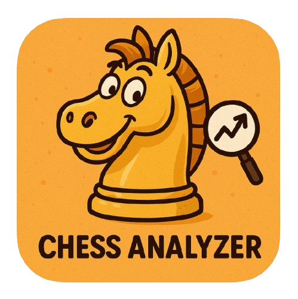

# Chess Analyzer Pro




**Chess Analyzer Pro** is a powerful, full-stack Python desktop application designed to bring professional-grade chess analysis to your local machine. Inspired by platforms like Chess.com, it combines the robust analysis capabilities of Stockfish with a sleek, responsive PyQt6 interface.

## 📸 Screenshots


| Analysis View | Stats Tab | Settings Tab | History Tab |
|:-------------:|:------------:|:---------:|:---:|
|  |  |  |  |


## 🚀 Features

### Core Analysis
- **Stockfish Integration**: Leverages the world's strongest chess engine for deep, move-by-move analysis.
- **Move Classification**: Automatically classifies every move (Brilliant, Great, Best, Excellent, Good, Inaccuracy, Mistake, Blunder, Miss).
- **Win Probability**: Calculates and displays win probability swings for every move.

- **Opening Explorer**: Identifies openings and variations using a built-in book and online APIs.
- **Ending Analysis**: Charts game outcomes by type (Checkmate, Time, Resignation).

### User Interface
- **Interactive Board**: Fully functional chessboard with drag-and-drop support and visual move indicators.
- **Evaluation Graph**: Dynamic graph visualizing the game's evaluation flow.
- **Game List**: Easy navigation between multiple games in a PGN.
- **Move List**: Detailed move history with classification icons and evaluation scores.

### Import & Export
- **PGN Support**: Robust parsing for single and multi-game PGN files.
- **Chess.com Import**: Directly import games from Chess.com users or specific game URLs.
- **Lichess Import**: Import games directly from Lichess.org usernames.

### Audio & Visuals
- **Sound Effects**: Immersive audio feedback for moves, captures, checks, castles, and game completion.
- **Themes**: Modern dark theme for reduced eye strain during long analysis sessions.

## 🛠️ Installation

### Prerequisites
- Python 3.8 or higher
- [Stockfish Engine](https://stockfishchess.org/download/)

### Steps

1.  **Clone the Repository**
    ```bash
    git clone https://github.com/yourusername/chess-analyzer-pro.git
    cd chess-analyzer-pro
    ```

2.  **Create a Virtual Environment (Recommended)**
    Using [uv](https://github.com/astral-sh/uv) (faster and more reliable):
    ```bash
    # Install uv if you haven't already
    pip install uv

    # Create virtual environment
    uv venv .venv

    # Activate
    # Windows
    .venv\Scripts\activate
    # macOS/Linux
    source .venv/bin/activate
    ```

3.  **Install Dependencies**
    ```bash
    uv pip install -r requirements.txt
    ```

4.  **Setup Stockfish**
    - Download the Stockfish engine for your OS.
    - Extract the executable to a known location (e.g., inside a `stockfish/` folder in the project root).

## 🎮 Usage

1.  **Run the Application**
    ```bash
    uv main.py
    ```

2.  **Configure Engine**
    - Go to `Settings > Configure Engine...`.
    - Select your Stockfish executable path.

3.  **Load a Game**
    - **File > Open PGN...**: Load a local `.pgn` file.
    - **File > Load from Chess.com User...**: Fetch recent games for a specific user.

    - **File > Load from Lichess User...**: Fetch recent games for a Lichess user.
    - **File > Load from Chess.com URL...**: Analyze a specific game URL.

4.  **Analyze**
    - Click `Analysis > Analyze Game` to start the engine.
    - Watch the progress bar as the engine evaluates each move.
    - Once complete, explore the move list and graph!

## 🧪 Testing

Run the test suite to ensure everything is working correctly:

```bash
python -m pytest tests/
```

## 🤝 Contributing

Contributions are welcome! Please follow these steps:

1.  Fork the repository.
2.  Create a new branch (`git checkout -b feature/YourFeature`).
3.  Commit your changes (`git commit -m 'Add some feature'`).
4.  Push to the branch (`git push origin feature/YourFeature`).
5.  Open a Pull Request.

## 🔮 Roadmap (Version 2.0)

- [ ] **Cloud Analysis**: Offload heavy analysis to cloud servers.
- [ ] **PDF Export**: Generate professional PDF reports.
- [ ] **Coach Mode**: AI-powered natural language explanations.
- [ ] **Opening Repertoire Builder**: Tools to build and practice openings.
- [ ] **Endgame Tablebases**: Integration with Syzygy tablebases.
- [ ] **Multi-Engine Support**: Compare analysis from different engines.

## 📄 License

This project is licensed under the MIT License - see the [LICENSE](LICENSE) file for details.

## 🙏 Acknowledgements

- [Stockfish](https://stockfishchess.org/) for the powerful chess engine.
- [Python-Chess](https://python-chess.readthedocs.io/) for the chess library.
- [PyQt6](https://www.riverbankcomputing.com/software/pyqt/) for the GUI framework.

