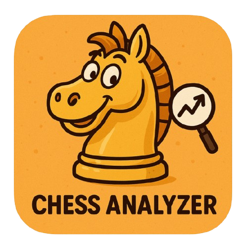

# Chess Analyzer Pro




> 🌐 **Official Website:** [chess-analyzer-ut.vercel.app](https://chess-analyzer-ut.vercel.app/)  
> Visit the official site for detailed documentation, latest updates, and to report bugs or request features.

**Chess Analyzer Pro** is a powerful, full-stack Python desktop application designed to bring professional-grade chess analysis to your local machine. Inspired by platforms like Chess.com, it combines the robust analysis capabilities of Stockfish with a sleek, responsive PyQt6 interface.

## 📸 Screenshots

| Analysis View | Load Game | History Tab | Stats Tab | Settings Tab |
|:-------------:|:---------:|:-----------:|:---------:|:------------:|
|  |  |  |  |  |


## 🚀 Features

### Core Analysis
- **Stockfish Integration**: Leverages the world's strongest chess engine for deep, move-by-move analysis.
- **Move Classification**: Automatically classifies every move (Brilliant, Great, Best, Excellent, Good, Inaccuracy, Mistake, Blunder, Miss).
- **AI Coach Summaries**: Generates natural language post-game explanations using any OpenAI-compatible endpoint. Out-of-the-box support for **Groq** (Cloud), **LM Studio** (Local), **MiniMax** (Cloud), and **Custom endpoints**.
- **Win Probability**: Calculates and displays win probability swings for every move.

- **Opening Explorer**: Identifies openings and variations using a built-in book and online APIs.
- **Ending Analysis**: Charts game outcomes by type (Checkmate, Time, Resignation).

### User Interface
- **Interactive Board**: Fully functional chessboard with drag-and-drop support and visual move indicators.
- **Evaluation Graph**: Dynamic graph visualizing the game's evaluation flow.
- **Game List**: Easy navigation between multiple games in a PGN.
- **Move List**: Detailed move history with classification icons and evaluation scores.
- **Highly Configurable Settings**: Dedicated settings page where application data and preferences (e.g., engine paths, API keys, usernames) are easily managed and automatically saved to a local user JSON file.

### Import & Export
- **PGN Support**: Robust parsing for single and multi-game PGN files.
- **Direct Text Input**: Paste PGN text directly from your clipboard for quick analysis.
- **Web Imports**:
    - **Chess.com**: Import from user profiles or specific game URLs.
    - **Lichess**: Import from usernames or specific game URLs.
- **Data Backup**: Export your entire game history to CSV for backup or analysis in other tools, and import it back seamlessly.

### Audio & Visuals
- **Splash Screen**: Beautiful startup screen for a polished launch experience.
- **Sound Effects**: Immersive audio feedback for moves, captures, checks, castles, and game completion.
- **Board Themes**: Multiple board color themes to customize your chessboard appearance.
- **Piece Themes**: Choose from different piece sets to personalize your playing experience.
- **Dark Mode**: Modern dark theme for reduced eye strain during long analysis sessions.

## 💻 Tech Stack
- **Core**: Python 3.10+
- **GUI**: PyQt6 (Modern, responsive desktop interface)
- **Engine**: Stockfish (Via UCI protocol for world-class analysis)
- **Database**: **SQLite** references locally (`analysis_cache.db`) to cache analysis results, ensuring instant loading for previously analyzed games.
- **Config**: Local `config.json` for persistent user settings.
- **Integrations**: 
  - **LLM Providers**: AI-powered natural language game summaries. Natively supports **Groq**, **LM Studio**, **MiniMax**, and **Custom OpenAI-compatible** servers.
  - **Lichess & Chess.com**: Direct game import APIs.

## 🔒 Data Privacy & Local Storage
We prioritize your privacy. **Chess Analyzer Pro** is a "Local-First" application.

- **Local Database**: All analysis data and game history are stored in a local SQLite database (`analysis_cache.db`).
- **No Cloud Uploads**: Your games and moves are **never** uploaded to our servers. Analysis happens entirely on your machine using the bundled Stockfish engine.
- **Secure Config**: API keys (Groq, Lichess) are stored locally in `config.json` and are never shared.

## 🛠️ Installation

### Prerequisites
- Python 3.8 or higher
- [Stockfish Engine](https://stockfishchess.org/download/)

### Steps

1.  **Clone the Repository**
    ```bash
    git clone https://github.com/yourusername/chess-analyzer-pro.git
    cd chess-analyzer-pro
    ```

2.  **Create a Virtual Environment (Recommended)**
    Using [uv](https://github.com/astral-sh/uv) (faster and more reliable):
    ```bash
    # Install uv if you haven't already
    pip install uv

    # Create virtual environment
    uv venv .venv

    # Activate
    # Windows
    .venv\Scripts\activate
    # macOS/Linux
    source .venv/bin/activate
    ```

3.  **Install Dependencies**
    ```bash
    uv pip install -r requirements.txt
    ```

4.  **Setup Stockfish**
    - Download the Stockfish engine for your OS.
    - Extract the executable to a known location (e.g., inside a `stockfish/` folder in the project root).

## 🎮 Usage

1.  **Run the Application**
    ```bash
    python main.py
    ```

2.  **Configure Engine**
    - Go to the **Settings** tab in the sidebar.
    - Under **Chess Engine**, select your Stockfish executable path and click **Save Engine Path**.
    - Click **Test Engine** to verify the path is valid.

3.  **Load a Game**
    - Click **Load Game** at the top of the Analyze tab (or press `Ctrl+O`).
    - The unified dialog will open. Choose one of the four tabs:
      - **PGN File**: Drag and drop or browse for a `.pgn` file.
      - **PGN Text**: Paste raw PGN text directly.
      - **Chess.com**: Fetch games by username or game URL.
      - **Lichess**: Fetch games by username or game URL.
    - Double-click or select a game and click **Load Game**.

4.  **Analyze**
    - Click **Analyze Game** in the left sidebar controls.
    - Watch the status bar as the engine evaluates each move.
    - Once complete, explore the evaluation graph and move classifications!

## 🧪 Testing

Run the test suite to ensure everything is working correctly:

```bash
python -m pytest tests/
```

## 🤝 Contributing

Contributions are welcome! Please see our [CONTRIBUTING.md](CONTRIBUTING.md) for details on how to get started, set up your development environment, and submit pull requests.

## 📄 License

This project is licensed under the MIT License - see the [LICENSE](LICENSE) file for details.

> **Note:** The chess piece graphics in `assets/pieces/` are a separate work
> licensed under CC BY-SA 3.0 (see the [Third-Party Assets](#-third-party-assets)
> section below).

## Third-Party Assets

The chess piece graphics shipped in [`assets/pieces/`](assets/pieces/) come from
the **Cburnett** SVG chess set by **Colin M.L. Burnett**.

- Source: [Wikimedia Commons — SVG chess pieces](https://commons.wikimedia.org/wiki/Category:SVG_chess_pieces)
- License: [CC BY-SA 3.0](https://creativecommons.org/licenses/by-sa/3.0/)
- Per-file notice: see [assets/pieces/THIRD-PARTY-README.md](assets/pieces/THIRD-PARTY-README.md)

The SVGs are kept in a separate directory so they can be replaced or removed
without touching the MIT-licensed source code.

## Acknowledgements

- [Stockfish](https://stockfishchess.org/) for the powerful chess engine.
- [Python-Chess](https://python-chess.readthedocs.io/) for the chess library.
- [PyQt6](https://www.riverbankcomputing.com/software/pyqt/) for the GUI framework.
- Chess piece graphics by **Colin M.L. Burnett (Cburnett)**, distributed via
  [Wikimedia Commons](https://commons.wikimedia.org/wiki/Category:SVG_chess_pieces)
  and used in the [Lichess](https://lichess.org) project (CC BY-SA 3.0).

