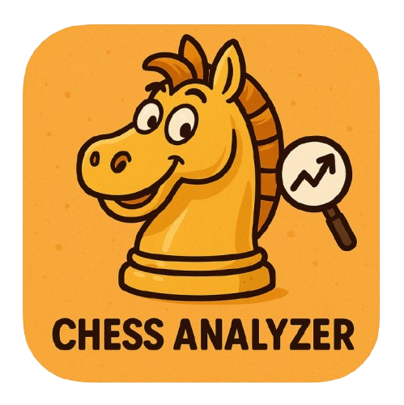

# Chess Analyzer Pro

  [](https://github.com/imutkarsht/Chess_analyzer/actions/workflows/test.yml) 



> 🌐 **Official Website:** [chessanalyzer.xyz](https://chessanalyzer.xyz/)  
> Visit the official site for detailed documentation, latest updates, and to report bugs or request features.

## 🎥 Showcase

<p align="center">
  <a href="https://ik.imagekit.io/hghxc7q4v/Chess%20Analyzer/v2.1/showcasevideo.mp4" target="_blank">
    
    <br>
    <sub>▶ Click to watch the showcase video</sub>
  </a>
</p>

**Chess Analyzer Pro** is a powerful, full-stack Python desktop application designed to bring professional-grade chess analysis to your local machine. Inspired by platforms like Chess.com, it combines the robust analysis capabilities of Stockfish with a sleek, responsive PyQt6 interface.

## 📸 Screenshots

| Deep Analysis & Live Lines | Opening Explorer |
| :-: | :-: |
|  |  |

| Game History & Cards | Performance Metrics |
| :-: | :-: |
|  |  |

<details>
<summary><b>🔍 View More Screens (Settings, Game Import & Feedback)</b></summary>
<br>

| Settings (Dark Mode) | Settings (Light Mode) |
| :-: | :-: |
|  |  |

| Online Game Fetcher | In-App Review & Diagnostics |
| :-: | :-: |
|  |  |

</details>

## 🚀 Features

### Core Analysis

- **Stockfish Integration**: Leverages the world's strongest chess engine for deep analysis with **live move-by-move progressive updates**.
- **Move Classification**: Automatically classifies every move (Brilliant, Great, Best, Excellent, Good, Inaccuracy, Mistake, Blunder, Miss).
- **AI Coach Summaries**: Generates natural language post-game explanations using any OpenAI-compatible endpoint. Out-of-the-box support for **Groq** (Cloud), **LM Studio** (Local), **MiniMax** (Cloud), and **Custom endpoints**.
- **Win Probability**: Calculates and displays win probability swings for every move.
- **Opening Explorer**: Deep opening analysis using a built-in local SQLite openings database, custom Polyglot opening books (`*.bin` files), and live **Lichess Masters & Public game database integration** with Win/Draw/Loss ratio bars.
- **Ending & Termination Analysis**: Detects and charts game outcomes by exact termination reason (Checkmate, Time, Resignation, Stalemate, Abandonment, Insufficient Material).

### User Interface

- **Interactive Board**: Fully functional chessboard with drag-and-drop support and visual move indicators.
- **Evaluation Graph**: Dynamic graph visualizing the game's evaluation flow with an interactive active move cursor pin.
- **Game List & History**: Modern desktop game cards with time control badges, rating tags, and view mode toggle (Detailed Cards vs. Compact Table).
- **Move List**: Detailed move history with classification icons, evaluation scores, and live engine lines.
- **Highly Configurable Settings**: Card-based settings page where engine parameters, API keys, online accounts, and themes are easily managed and saved.

### Import & Export

- **PGN Support**: Robust parsing for single and multi-game PGN files with drag-and-drop loading.
- **Direct Text Input**: Paste PGN text directly from your clipboard for quick analysis.
- **Web Imports**:
  - **Chess.com**: Import recent matches, filter archives by date, or load specific game URLs.
  - **Lichess**: Import recent matches, filter archives by date, or load specific game URLs.
- **Data Backup & Caching**: Local SQLite caching for instant repeat loads and CSV export for external analysis.

### Audio & Visuals

- **Dual-Theme Support**: Full **Dark Mode** and **Light Mode** support with dynamic theme switching.
- **Live Accent Colors**: Change accent colors with instant live repainting without requiring an app restart.
- **Toast Notifications**: Clean floating toast alerts and styled confirmation dialogs.
- **Sound Effects**: Immersive audio feedback for moves, captures, checks, castles, and game completion.
- **Board Themes & Custom Pieces**: Multiple board colorways and custom piece SVG import support.

## 💻 Tech Stack

- **Core**: Python 3.10+
- **GUI**: PyQt6 (Modern, responsive desktop interface)
- **Engine**: Stockfish (Via UCI protocol for world-class analysis)
- **Database**: **SQLite** references locally (`analysis_cache.db`) to cache analysis results, ensuring instant loading for previously analyzed games.
- **Config**: Local `config.json` for persistent user settings.
- **Integrations**:
  - **LLM Providers**: AI-powered natural language game summaries. Natively supports **Groq**, **LM Studio**, **MiniMax**, and **Custom OpenAI-compatible** servers.
  - **Lichess & Chess.com**: Direct game import APIs and Lichess Opening Explorer.

## 🔒 Data Privacy & Local Storage

We prioritize your privacy. **Chess Analyzer Pro** is a "Local-First" application.

- **Local Database**: All analysis data and game history are stored in a local SQLite database (`analysis_cache.db`).
- **No Cloud Uploads**: Your games and moves are **never** uploaded to our servers. Analysis happens entirely on your machine using the bundled Stockfish engine.
- **Secure Config**: API keys (Groq, Lichess) are stored locally in `config.json` and are never shared.

## 🛠️ Installation

### Prerequisites

- Python 3.10 or higher
- [Stockfish Engine](https://stockfishchess.org/download/)

### Steps

1.  **Clone the Repository**

    ```bash
    git clone https://github.com/imutkarsht/Chess_analyzer.git
    cd Chess_analyzer
    ```

2.  **Create a Virtual Environment (Recommended)** Using [uv](https://github.com/astral-sh/uv) (faster and more reliable):

    ```bash
    # Install uv if you haven't already
    pip install uv

    # Create virtual environment
    uv venv .venv

    # Activate
    # Windows
    .venv\Scripts\activate
    # macOS/Linux
    source .venv/bin/activate
    ```

3.  **Install Dependencies**

    ```bash
    uv pip install -r requirements.txt
    ```

4.  **Setup Stockfish**
    - Download the Stockfish engine for your OS (or use the in-app downloader).
    - Extract the executable to a known location (e.g., inside a `stockfish/` folder in the project root).

## 🎮 Usage

1.  **Run the Application**

    ```bash
    python main.py
    ```

2.  **Configure Engine & Opening Book**
    - Go to the **Settings** tab in the sidebar.
    - Under **Chess Engine**, enter or browse to your Stockfish executable path (or click Download Stockfish).
    - Under **Opening Book**, you can optionally specify a Polyglot opening book (`*.bin` file) to supplement opening line evaluations.

3.  **Load a Game**
    - Click **Load Game** at the top of the Analyze tab (or press `Ctrl+O`).
    - Choose your preferred loading method:
      - **Online Fetch**: Fetch from Chess.com or Lichess by recent games, date range, or game URL.
      - **PGN File**: Drag and drop or browse for `.pgn` files.
      - **PGN Text**: Paste raw PGN text directly.
    - Double-click or select a game and click **Load Game**.

4.  **Analyze**
    - Click **Analyze Game** in the left sidebar controls.
    - Watch real-time evaluations and move classifications stream live onto the board and move list.
    - Once complete, explore the evaluation graph, accuracy summary, and AI coach report!

## 🧪 Testing

Run the test suite to ensure everything is working correctly:

```bash
# Install dev dependencies first
pip install -r requirements-dev.txt

# Run all tests
PYTHONPATH=. pytest tests/ -v
```

> On Linux servers or CI without a display, set `QT_QPA_PLATFORM=offscreen` before running pytest.

## 🤝 Contributing

Contributions are welcome! Please see our [CONTRIBUTING.md](CONTRIBUTING.md) for details on how to get started, set up your development environment, and submit pull requests.

## 📄 License

This project is licensed under the MIT License - see the [LICENSE](LICENSE) file for details.

> **Note:** The chess piece graphics in `assets/pieces/` are a separate third-party work dual-licensed upstream under GPLv2+ and CC BY-SA 3.0, used and distributed in this project under [CC BY-SA 3.0](https://creativecommons.org/licenses/by-sa/3.0/) (see [Third-Party Assets](#third-party-assets) below).

## Third-Party Assets

The chess piece graphics shipped in [`assets/pieces/`](assets/pieces/) come from the **Cburnett** SVG chess set by **Colin M.L. Burnett**.

- Source: [Wikimedia Commons — SVG chess pieces](https://commons.wikimedia.org/wiki/Category:SVG_chess_pieces)
- Upstream License: Dual-licensed under **GPLv2+** and **CC BY-SA 3.0** (used here under [CC BY-SA 3.0](https://creativecommons.org/licenses/by-sa/3.0/))
- Per-file notice: see [`assets/pieces/THIRD-PARTY-README.md`](assets/pieces/THIRD-PARTY-README.md) and [`LICENSE`](LICENSE)

The SVGs are kept in a separate directory so they can be replaced or removed without touching the MIT-licensed source code.

## Acknowledgements

- [Stockfish](https://stockfishchess.org/) for the powerful chess engine.
- [Python-Chess](https://python-chess.readthedocs.io/) for the chess library.
- [PyQt6](https://www.riverbankcomputing.com/software/pyqt/) for the GUI framework.
- [Lichess openings database](https://github.com/lichess-org/chess-openings) for providing the compiled opening datasets.
- Chess piece graphics by **Colin M.L. Burnett (Cburnett)**, distributed via [Wikimedia Commons](https://commons.wikimedia.org/wiki/Category:SVG_chess_pieces) and used in the [Lichess](https://lichess.org) project (CC BY-SA 3.0).
